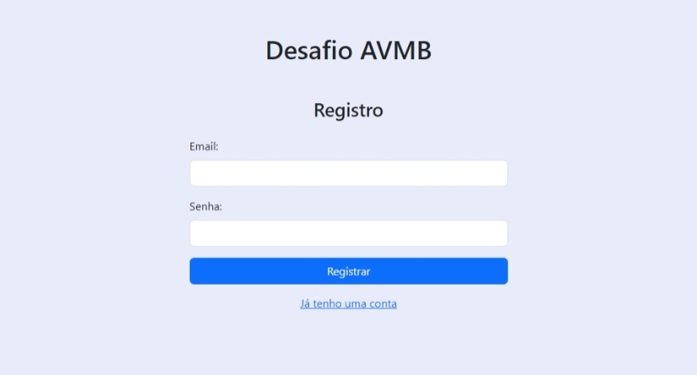
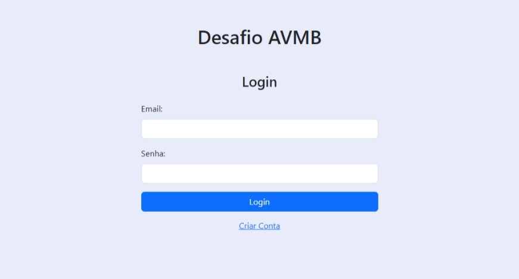
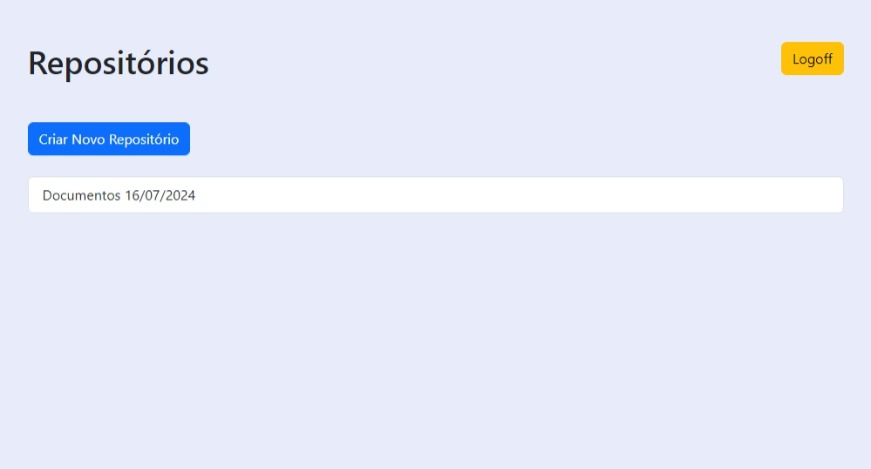
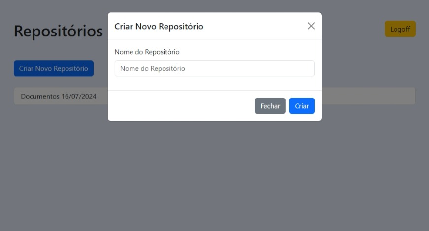
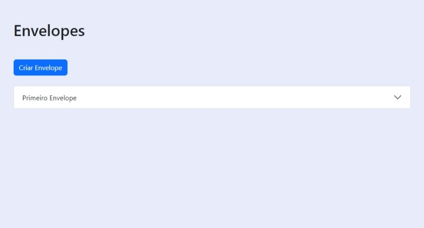
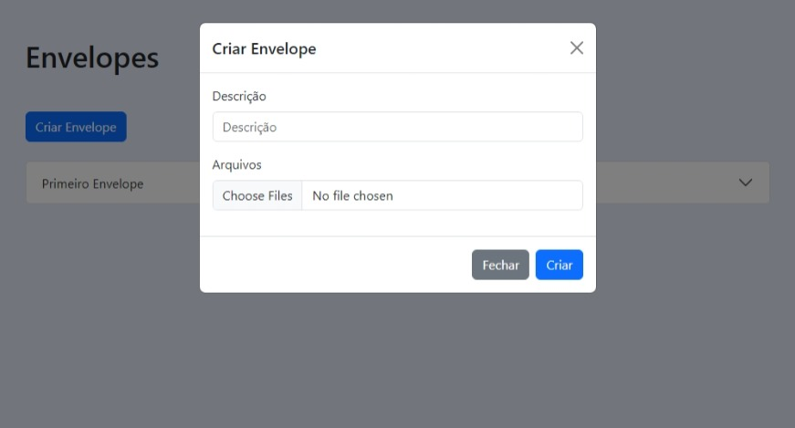
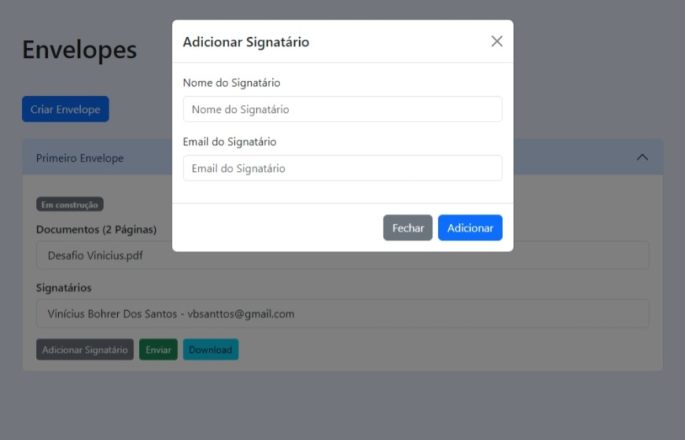

# Digital Signature

This is a single-page application (SPA) featuring user authentication, repository management, and handling of digital envelopes with documents and signatories.

## Technologies

- Vite
- Vue.js
- Vue Router
- Pinia
- Bootstrap

## Usage

```bash
docker compose up -d
```

## Screenshots

### Register



### Login



### Repositories



### Create Repository



### Envelopes



### Create Envelope



### Envelope Details


### Add Signatory


