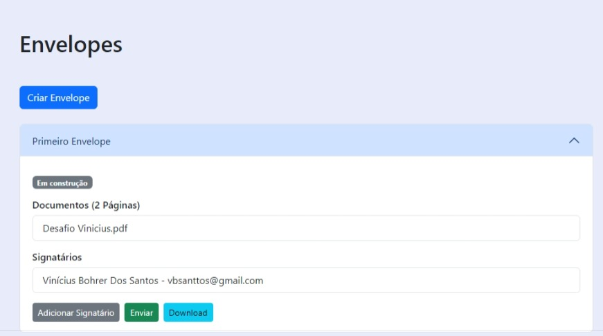

# Digital Signature

This is a single-page application (SPA) featuring user authentication, repository management, and handling of digital envelopes with documents and signatories.

## Technologies

- Vite
- Vue.js
- Vue Router
- Pinia
- Bootstrap

## Usage

```bash
docker compose up -d
```

## Screenshots

### Register


### Login


### Repositories


### Create Repository


### Envelopes


### Create Envelope


### Envelope Details



### Add Signatory


